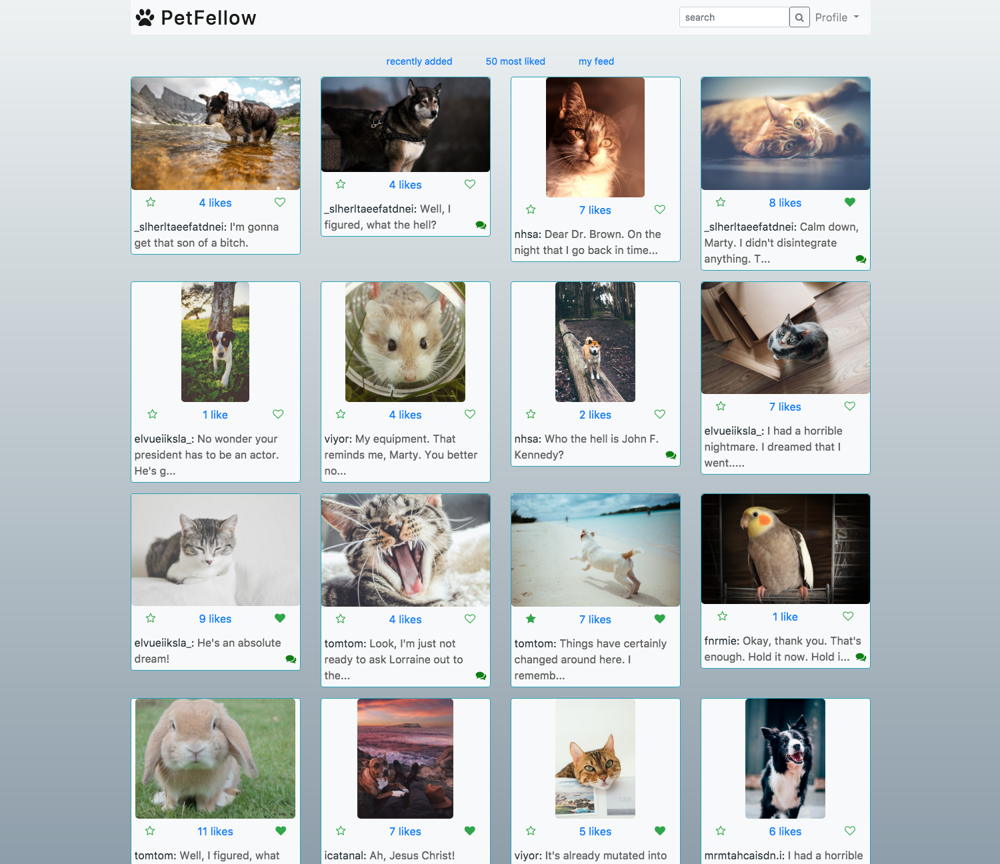

# PetFellow
`(currently in development)`
### Social network for pet lovers!

> User stories:
>  * user can see a homepage with recent and 50 most liked posts
>  * user can register / sign in
>  * registered user can:
>      * edit/delete profile
>      * create/edit/delete their own posts
>      * follow other users
>      * be followed by other users
>      * see their own profile
>      * see their other user's profiles
>      * search for users and posts
>      * send personal messages to other users
>      * like posts
>      * favorite posts

Stretch: adding tags, word checking, picture checking and tests

#### Current version look:

### Quickstart

1.  `bundle install`
2.  `bundle exec rake db:create`
3.  `bundle exec rake db:migrate`
4.  `bundle exec rake db:seed`
5.  `bundle exec shotgun config.ru`
6.  Open [http://localhost:9393](http://localhost:9393)
