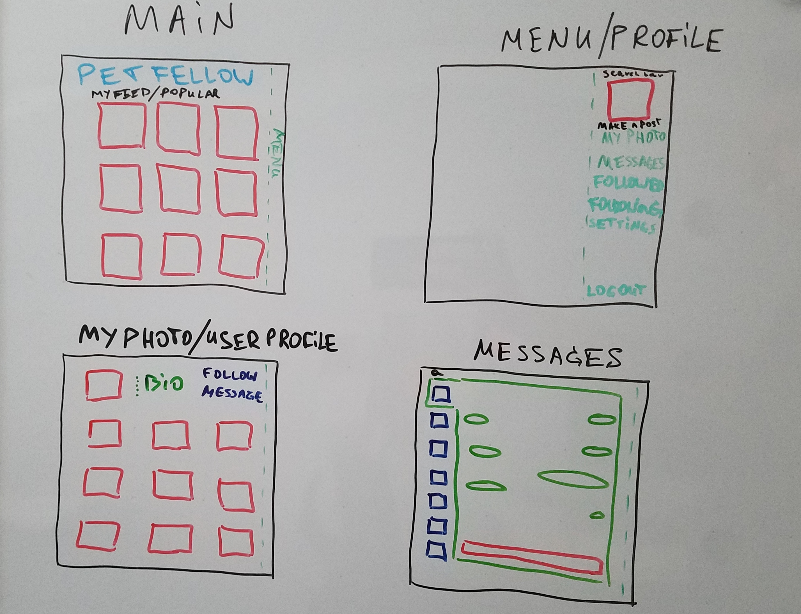

# PetFellow
### Social network for pet lovers!

> User stories:
* user can see a homepage  with recent picture posts
* user can register / sign in
* registered user can:
    * edit/delete profile
    * create/edit/delete his own posts
    * follow other users
    * be followed by other users
    * see their own profile
    * search for users
    * send personal messages
    * like posts
    * have favorite posts

Stretch: adding tags

#### Wireframing:

### Quickstart

1.  `bundle install`
2.  `bundle exec rake db:create`
3.  `bundle exec rake db:migrate`
4.  `bundle exec rake db:seed`
5.  `bundle exec shotgun config.ru`
6.  Open [http://localhost:9393](http://localhost:9393)
